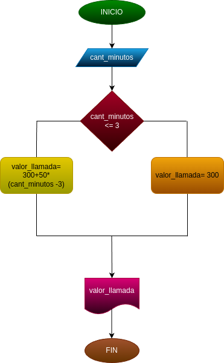

# Condicionales_1
Condicionales #1
## Costo de una llamada telefónica

Ingresar el tiempo de una llamada telefonica y determinar la cantidad a pagar de acuderdo con lo siguiente:

- Toda llamada que dure 3 minutos o menos,tiene un costo de trecientos pesos.
- Cada minuto adicional cuesta cincuenta pesos.

